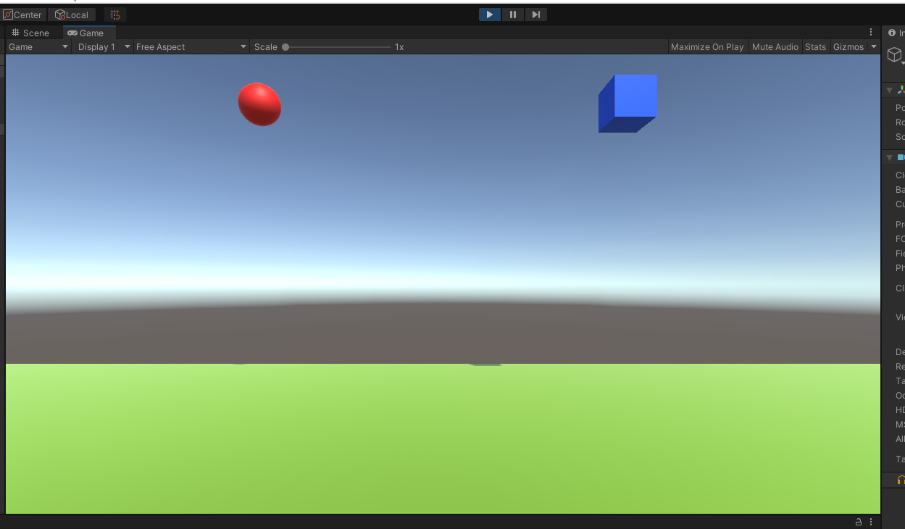
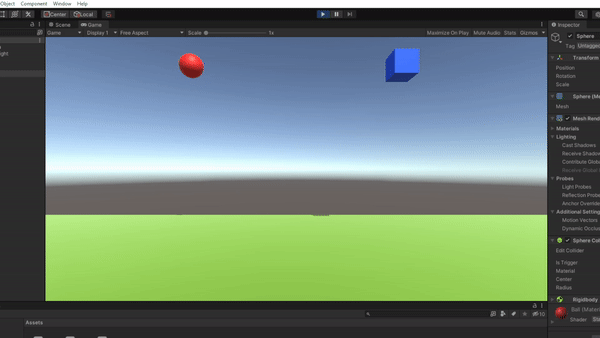
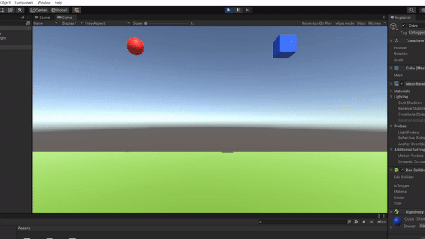
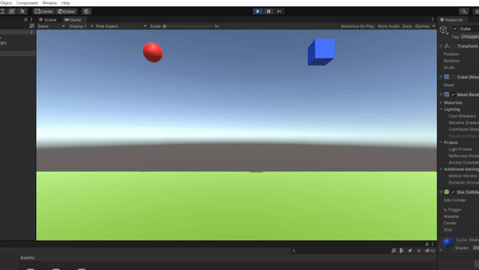
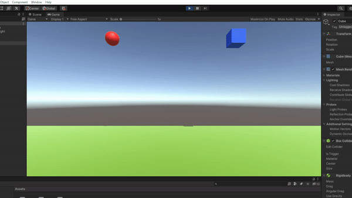
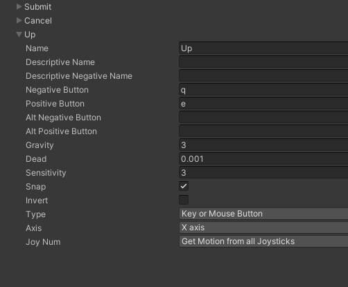
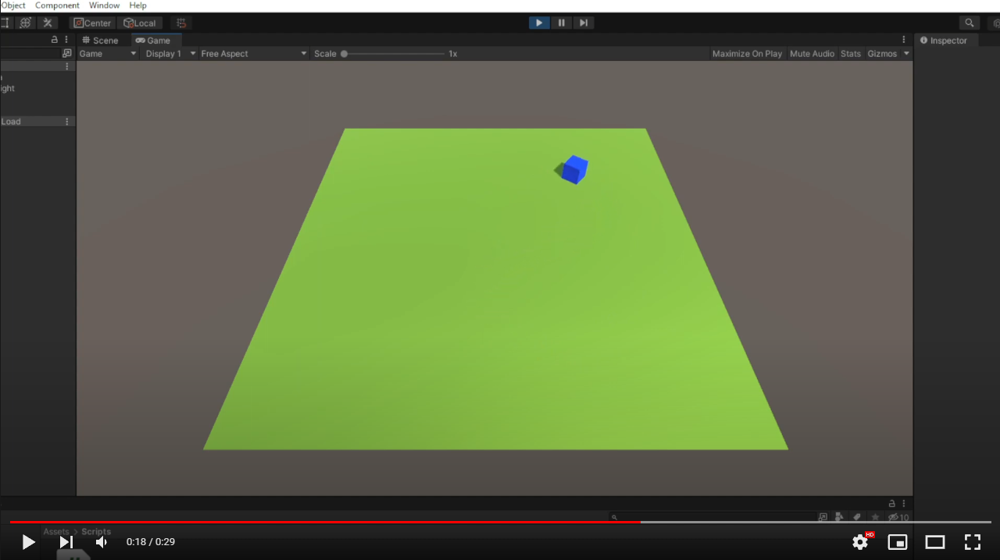

# Interfaces Inteligentes - Práctica 01 <!-- omit in toc -->

* Javier Correa Marichal (alu0101233598)
* Interfaces Inteligentes
* Universidad de La Laguna 21/22

## Tabla de contenidos <!-- omit in toc -->
- [Ejercicio 1](#ejercicio-1)
- [Ejercicio 2](#ejercicio-2)
- [Ejercicio 3](#ejercicio-3)

## Ejercicio 1

En este primer ejercicio, se propone crear una escena básica donde probar distintas configuraciones de objetos físicos en Unity. Para el desarrollo de este ejercicio, se ha creado la siguiente escena básica, utilizando primitivas 3D:


> a) Ninguno de los objetos será físicos

En este caso, nada ocurre en la escena al ejecutar el programa: los objetos se mantienen estáticos en las posiciones asignadas.



> b) La esfera tiene físicas, el cubo no

Al aplicar el componente Rigidbody a la esfera y ejecutar el programa, el objeto es afectado por el motor de físicas de Unity; provocando que la esfera caiga. Puesto que tanto la esfera como el plano tienen asignado un componente Collider, la esfera detiene su caída tras colisionar con el suelo.



> c) La esfera y el cubo tienen físicas

Al igual que en el apartado anterior, el cubo ahora cae junto a la esfera y se detiene al colisionar contra el plano.



> d) La esfera y el cubo son físicos y la esfera tiene 10 veces la masa del cubo

En este caso, la ejecución es idéntica a la del apartado anterior. Esto se debe a que aunque la masa haya aumentado, no existe una fricción con el aire que frene la caída de la esfera; por lo que ambos caen atraídos por la misma aceleración.


> e) La esfera tiene físicas y el cubo es de tipo IsTrigger

El comportamiento es el mismo que el estudiado en el apartado B, puesto que el cubo permanece estático al no estar conectado con el motor de físicas de Unity.



> f) La esfera tiene físicas, el cubo es de tipo IsTrigger y tiene físicas

El cubo en esta ocasión cae, al tener asignado un componente Rigidbody. Puesto que también posee un Colilder de tipo trigger, no colisiona con el plano y lo atraviesa. La esfera mantiene el comportamiento definido en apartados anteriores.


> g) La esfera y el cubo son físicos y la esfera tiene 10 veces la masa del cubo, se impide la rotación del cubo sobre el plano XZ

El comportamiento es el mismo que el explicado en el apartado D. La esfera y el cubo caen a la vez, por los motivos ya explicados; y el cubo atraviesa el plano al tener un Collider de tipo trigger. La restricción en la rotación del cubo no influye en el movimiento del cubo, pues este no se encuentra afectado por ninguna fuerza rotacional.



## Ejercicio 2

Para la resolución de este ejercicio, se dispone de una escena donde se encuentran el cubo y plano utiliziado en el ejercicio anterior. En primer lugar, es necesaria la creación de un nuevo eje virtual para el giro del jugador sobre el eje OY. Para ello, accedemos al panel de configuración de entrada ubicado en `Edit > Project Settings > Input Manager` y creamos el eje "Up":



Con esta nueva entrada configurada, podemos proceder a la creación del script CharacterController.cs, encargado de detectar las acciones del jugador y aplicar el movimiento que corresponda al cubo:

```csharp
public class CharacterController : MonoBehaviour
{
    public float translationSpeed = 5f;
    public float rotationSpeed = 100f;
    
    void Update()
    {
        float horizontalMove = Input.GetAxis("Horizontal") * translationSpeed * Time.deltaTime;
        float verticalMove = Input.GetAxis("Vertical") * translationSpeed * Time.deltaTime;
        float upMove = Input.GetAxis("Up") * rotationSpeed * Time.deltaTime;
        transform.Translate(new Vector3(horizontalMove, 0f, verticalMove));
        transform.Rotate(new Vector3(0f, upMove, 0f));
    }
}
```

En el siguiente vídeo, se muestra el resultado obtenido al ejecutar el programa:

[](http://www.youtube.com/watch?v=Lqj6ouJ0g54)

## Ejercicio 3

