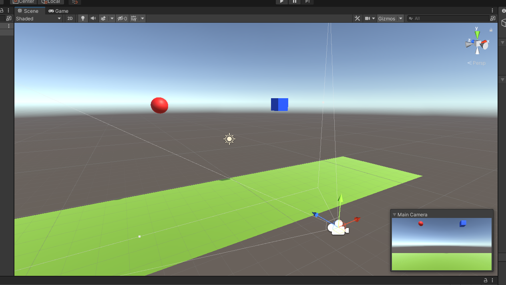

# Interfaces Inteligentes - Práctica 01 <!-- omit in toc -->

* Javier Correa Marichal (alu0101233598)
* Interfaces Inteligentes
* Universidad de La Laguna 21/22

## Tabla de contenidos <!-- omit in toc -->
- [Ejercicio 1](#ejercicio-1)
- [Ejercicio 2](#ejercicio-2)
- [Ejercicio 3](#ejercicio-3)

## Ejercicio 1

En este primer ejercicio, se propone crear una escena básica donde probar distintas configuraciones de objetos físicos en Unity. Para el desarrollo de este ejercicio, se ha creado la siguiente escena básica, utilizando primitivas 3D:



> a) Ninguno de los objetos será físicos

En este caso, nada ocurre en la escena al ejecutar el programa: los objetos se mantienen estáticos en las posiciones asignadas.


> b) La esfera tiene físicas, el cubo no

Al aplicar el componente Rigidbody a la esfera y ejecutar el programa, el objeto es afectado por el motor de físicas de Unity; provocando que la esfera caiga. Puesto que tanto la esfera como el plano tienen asignado un componente Collider, la esfera detiene su caída tras colisionar con el suelo.


> c) La esfera y el cubo tienen físicas

Al igual que en el apartado anterior, el cubo ahora cae junto a la esfera y se detiene al colisionar contra el plano.


> d) La esfera y el cubo son físicos y la esfera tiene 10 veces la masa del cubo

En este caso, la ejecución es idéntica a la del apartado anterior. Esto se debe a que aunque la masa haya aumentado, no existe una fricción con el aire que frene la caída de la esfera; por lo que ambos caen atraídos por la misma aceleración.


> e) La esfera tiene físicas y el cubo es de tipo IsTrigger

El comportamiento es el mismo que el estudiado en el apartado B, puesto que el cubo permanece estático al no estar conectado con el motor de físicas de Unity.


> f) La esfera tiene físicas, el cubo es de tipo IsTrigger y tiene físicas

El cubo en esta ocasión cae, al tener asignado un componente Rigidbody. Puesto que también posee un Collider de tipo trigger, no colisiona con el plano y lo atraviesa. La esfera mantiene el comportamiento definido en apartados anteriores.


> g) La esfera y el cubo son físicos y la esfera tiene 10 veces la masa del cubo, se impide la rotación del cubo sobre el plano XZ

El comportamiento es el mismo que el explicado en el apartado D. La esfera y el cubo caen a la vez, por los motivos ya explicados; y el cubo atraviesa el plano al tener un Collider de tipo trigger. La restricción en la rotación del cubo no influye en el movimiento del cubo, pues este no se encuentra afectado por ninguna fuerza rotacional.


## Ejercicio 2

Para la resolución de este ejercicio, se dispone de una escena donde se encuentran el cubo y plano utiliziado en el ejercicio anterior. En primer lugar, es necesaria la creación de un nuevo eje virtual para el giro del jugador sobre el eje OY. Para ello, accedemos al panel de configuración de entrada ubicado en `Edit > Project Settings > Input Manager` y creamos el eje "Up":


Con esta nueva entrada configurada, podemos proceder a la creación del script CharacterController.cs, encargado de detectar las acciones del jugador y aplicar el movimiento que corresponda al cubo:

```csharp
public class CharacterController : MonoBehaviour
{
    public float translationSpeed = 5f;
    public float rotationSpeed = 100f;
    
    void Update()
    {
        float horizontalMove = Input.GetAxis("Horizontal");
        float verticalMove = Input.GetAxis("Vertical");
        float upMove = Input.GetAxis("Up");
        transform.Translate(new Vector3(horizontalMove, 0f, verticalMove) * translationSpeed * Time.deltaTime);
        transform.Rotate(new Vector3(0f, upMove, 0f) * rotationSpeed * Time.deltaTime);
    }
}
```

En el siguiente vídeo, se muestra el resultado obtenido al ejecutar el programa:

[](http://www.youtube.com/watch?v=Lqj6ouJ0g54)

## Ejercicio 3

En este ejercicio, se pide resolver una serie de cuestiones relacionadas con el desarrollo de scripts:

> a) Cada vez que el jugador colisione con un cilindro, deben aumentar su tamaño y el jugador aumentar puntuación

Partiendo de la escena anterior, se desarrolló en primer lugar un objeto que actuase como gestor de la puntuación del juego, denominado GameManager. Para implementar la lógica de este actor, se desarrolló el siguiente script:

```csharp
public class GameManager : MonoBehaviour
{
    public static GameManager instance = null;
    public Text scoreText;

    private int score = 0;

    void Awake()
    {
        if (instance == null) instance = this;
        else if (instance != this) Destroy(gameObject);
    }

    void Start()
    {
        scoreText.text = score.ToString();
    }

    public void updateScore(int amount)
    {
        score += amount;
        scoreText.text = score.ToString();
    }
}
```

Con el script anterior, es posible acceder al método encargado de aumentar la puntuación utilizando la expresión `GameManager.instance.updateScore()`. Una vez resuelta esta cuestión, se procedió a la creación de un script `CylinderBehaviour.cs` que gestionase el comportamiento de los cilindros:

```csharp
public class CylinderBehaviour : MonoBehaviour
{
    [Header("General")]
    public float growSpeed = 0.5f;

    void OnCollisionEnter(Collision other)
    {
        if (other.gameObject.tag == "Player")
        {
            GameManager.instance.updateScore(1);
            transform.localScale += new Vector3(growSpeed, growSpeed, growSpeed);
        }    
    }
}
```

>  b) Agregar cilindros de tipo A, en los que además, si el jugador pulsa la barra espaciadora lo mueve hacia fuera de él.

Para considerar este nuevo tipo de cilindro, se actualizó el script `CylinderBehaviour.cs`:

```csharp
public class CylinderBehaviour : MonoBehaviour
{
    [Header("General")]
    public float growSpeed = 0.5f;

    [Header("Cylinder A")]
    public bool isTypeA = false;
    public float repelSpeed = 5f;

    private Rigidbody rb;
    private GameObject player;
    
    void Awake()
    {
        rb = GetComponent<Rigidbody>();
        player = GameObject.FindWithTag("Player");
    }

    void Update()
    {
        if ((Input.GetKeyDown("space") && isTypeA))
        {
            repel();
        }
    }

    void OnCollisionEnter(Collision other)
    {
        if (other.gameObject.tag == "Player")
        {
            GameManager.instance.updateScore(1);
            transform.localScale += new Vector3(growSpeed, growSpeed, growSpeed);
        }    
    }

    private void repel()
    {
        Vector3 forceDirection = Vector3.Normalize(transform.position - player.transform.position);
        rb.AddForce(forceDirection * repelSpeed);
    }
}
```

> c) Agregar cilindros de tipo B que se alejen del jugador cuando esté próximo

Para considerar este nuevo tipo de cilindro, se actualizó el script `CylinderBehaviour.cs`:

```csharp
public class CylinderBehaviour : MonoBehaviour
{
    [Header("General")]
    public float growSpeed = 0.5f;

    [Header("Cylinder A")]
    public bool isTypeA = false;
    public float repelSpeed = 5f;

    [Header("Cylinder B")]
    public bool isTypeB = false;
    public float triggerDistance = 5f;

    private Rigidbody rb;
    private GameObject player;
    
    void Awake()
    {
        rb = GetComponent<Rigidbody>();
        player = GameObject.FindWithTag("Player");
    }

    void Update()
    {
        if ((Input.GetKeyDown("space") && isTypeA))
        {
            repel();
        }
        else if (isTypeB)
        {
            float distance = Vector3.Distance(player.transform.position, transform.position);
            if (distance <= triggerDistance) repel();
        }
    }

    void OnCollisionEnter(Collision other)
    {
        if (other.gameObject.tag == "Player")
        {
            GameManager.instance.updateScore(1);
            transform.localScale += new Vector3(growSpeed, growSpeed, growSpeed);
        }    
    }

    private void repel()
    {
        Vector3 forceDirection = Vector3.Normalize(transform.position - player.transform.position);
        rb.AddForce(forceDirection * repelSpeed);
    }
}
```

> d) Ubicar un tercer objeto que sea capaz de detectar colisiones y que se mueva con las teclas: I, L, J, M

Para crear este nuevo objeto, se definió una nueva pareja de ejes virtuales; copia de los ejes "Horizontal" y "Vertical" utilizados anteriormente, pero asignando las teclas I, L, J y M a los mismos. Aprovechando que este nuevo objeto tiene asignado un Rigidbody (puesto que es necesario para la detección de colisiones), el movimiento del agente utiliza la función `rb.MovePosition()` de la siguiente forma:

```csharp
    public float translationSpeed = 5f;
    
    private Rigidbody rb;
    private Renderer renderer;

    void Awake() {
        rb = GetComponent<Rigidbody>();
        renderer = GetComponent<Renderer>();
    }

    void FixedUpdate()
    {
        Vector3 mInput = new Vector3(Input.GetAxis("OtherHorizontal"), 0f, Input.GetAxis("OtherVertical"));
        rb.MovePosition(rb.position + (mInput * Time.deltaTime * translationSpeed));
    }
```

Cada vez que se detecta una colisión, se llama al método `OnCollisionEnter()`. Para mostrar de forma visual que se ha producido un impacto, se cambia el color del material asignado al GameObject:

```csharp
    void OnCollisionEnter(Collision other) {
        if (other.gameObject.tag != "Floor") {
            Debug.Log("Collisioned with " + other.gameObject.name);
            renderer.material.color = Color.HSVToRGB(Random.value, 0.5f, 0.9f);
        }
    }
```

> e) Debes ubicar cubos que aumentan de tamaño cuando se le acerca una esfera y que disminuye cuando se le acerca el jugador

Para detectar cuándo un objeto se acerca al cubo, se eliminó el collider por defecto asociado al mismo y se le asignó uno en forma de esfera, asignado con la propiedad isTrigger:


A este objeto, se le asignó el siguiente script `CubeBehaviour.cs`:

```csharp
public class CubeBehaviour : MonoBehaviour
{
    public float scaleSpeed = 1.5f;

    private SphereCollider collider;
    private float radius;
    private Vector3 originalSize;

    void Awake()
    {
        collider = GetComponent<SphereCollider>();
        originalSize = transform.localScale;
        radius = collider.radius * originalSize.x;
    }

    void OnTriggerStay(Collider other)
    {
        if (other.gameObject.tag == "Sphere" || other.gameObject.tag == "Player") {
            float distance = Vector3.Distance(other.gameObject.transform.position, transform.position);
            if (distance < radius)
            {
                float scaleAmount = (other.gameObject.tag == "Player" ? -1 : 1) * (1 - distance / radius) * scaleSpeed;
                transform.localScale = new Vector3(originalSize.x + scaleAmount, originalSize.y + scaleAmount, originalSize.z + scaleAmount);
            }
        }
    }
}
```

> Demostración del funcionamiento

El funcionamiento de los distintos requisitos de este ejercicio puede apreciarse en el siguiente vídeo:

[](https://youtu.be/rjmOIxd8j5U)